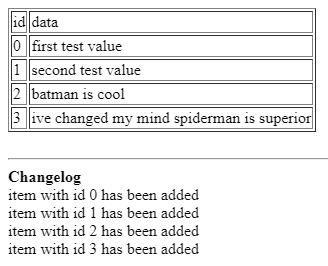

# qtHttp
Simple http rest server written using Qt

It is a part of a job interview task

It listens to 1234 port os you can access it with localhost:1234/

### Description
This web app has two pages:
 - ```/test``` Shows data stored in temporary "data base" (its a map stored in RAM) with hardcoded 4 examples
   - 
 - ```/api``` Place where you can edit data with ```POST```, ```PUT```, ```DELETE``` methods or get single value with ```GET```
   - ```POST``` creates new record
     - arguments: *val* (string) - *val* is a value to be written down. Id will be created automatically 
     - arguments should be sent in request's body using x-www-form-urlencoded
   - ```PUT``` edits existing record
     - arguments: *id* (int); *val* (string) - record with id = *id* will be rewritten with new data from *val*
     - arguments should be sent in request's body using x-www-form-urlencoded
     - returns *Invalid id* if record with *id* does not exist
     - returns *Missing args* if it cant find required args
   - ```DELETE``` deletes existing record
     - arguments: *id* (int) - record with id = *id* will be deleted
     - arguments should be sent in request's body using x-www-form-urlencoded
     - returns *Invalid id* if record with *id* does not exist
     - returns *Missing args* if it cant find required args
   - ```GET``` returns value of an record
     - arguments: *id* (int) - record with id = *id* will be returned
     - arguments should be sent in request's url
     - returns *Invalid id* if record with *id* does not exist
     - returns *Missing args* if it cant find required args
